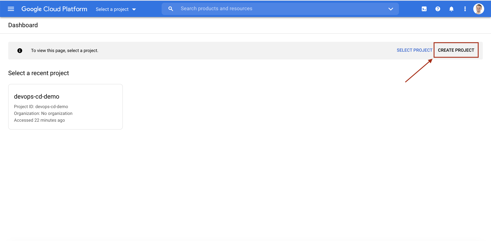

# CD of Node Express App on Google Cloud with designated realese branch using GitHub Actions

In this demo, we will demonstrate how to create a continuous deployment workflow using GitHub Actions that automate deployment of a simple Express server to Google App Engine (GAE), a fully managed, serverless platform for developing and hosting web applications at scale. This demo will go through the following:
1. How to create a simple Express server
2. How to create a project on Google Cloud
3. How to deploy the Express server to Google App Engine (GAE)
4. How to create a CD workflow to automate deployment using GitHub Actions

### Prerequisites:
1. A Cloud account, could be created using this [link](https://console.cloud.google.com/freetrial?_ga=2.23823484.712324435.1617348446-1668699610.1617348446) .
2. Google Cloud SDK, providing the gcloud command-line tool, [installation instructions](https://cloud.google.com/sdk/docs/install).
3. [Node.js](https://nodejs.org/en/).
4. A GitHub repository for your project, clone it and cd into it.

## Create a simple Express server

1. Navigate to the root of your GitHub repository.
2. Create a new folder called `src`.
3. Navigate into the newly created `src` folder in your terminal, and create a `package.json` file by running `npm init`.
4. Add Express as a dependency by running:
```js
npm install express
```
5. Add a start script to your `package.json` file:
```json
"scripts": {
  "start": "node index.js"
}
```
6. Create a file called `index.js` in the same folder and add the following code:
```js
const app = require('express')();

app.get('/', (_, res) => {
  res.send('Hello from App Engine, this app has automatically been deployed with GitHub!');
});

// The server listen to the App Engine-specified port process.env.PORT
// or on 8080 if run on your local machine.
const PORT = process.env.PORT || 8080;
app.listen(PORT, () => {
  console.log(`Server listening on port ${PORT}...`);
});
```

### Create the `app.yaml` file
The `app.yaml` file is a required config file for deploying to Google App Engine. Your service will not deploy without this file. The one used in this tutorial is a minimal configuration file, indicating to App Engine the version of the `Node.js` runtime. The `app.yaml` file can also specify network settings, scaling settings, and more. For more information, see the [`app.yaml` reference](https://cloud.google.com/appengine/docs/standard/nodejs/config/appref).

1. In your `src` folder, create a file called `app.yaml` with the following content:
```yaml
runtime: nodejs14
```


## Create Google Cloud Project
1. Open the [project selector page](https://console.cloud.google.com/projectselector2/home/dashboard) on Google Cloud console, and create a new Google Cloud project.

2. Enter your project name in the `Project name` field and press the `CREATE` button. This will set both the name and the ID of the project. The project ID is globally unique and cannot be changed after the project have been created.


### Connect project to Cloud SDK
1. [Log in to Google Cloud SDK](https://cloud.google.com/sdk/docs/authorizing) in your terminal using the following command:
```bash
gcloud auth login
```
2. Initialize your App Engine app with your project by running the following command:
```bash
gcloud app create --project=[YOUR_PROJECT_ID]
```
3. Choose [region](https://cloud.google.com/compute/docs/regions-zones) when prompted.
4. Set the defualt project in the Cloud SDK core section to your project by executing the following command:
```bash
gcloud config set project [YOUR_PROJECT_ID]
```
5. Go to [App Engine Admin API page](https://console.cloud.google.com/apis/library/appengine.googleapis.com) in the Google Cloud console and press the `ENABLE` button. Note: Make sure that your Project ID is set in the project selector dropdown at the top of the page.


## Deploy the Express project to Google Cloud

In your `src` folder, where the `app.yaml` file is located, run the following command in your terminal. Your source files are then uploaded to Google Cloud Storage. Cloud Build builds your app and deploys it to App Engine. `Node.js` modules are installed in the cloud as listed in your `package.json` and `package-lock.json` files and your service is started by using `npm start`.
```bash
gcloud app deploy
```
Go to `https://[YOUR_PROJECT_ID].[REGION_ID].r.appspot.com` in any browser to visit you deployed project. This could also be achieved with the following command:
```bash
gcloud app browse
```


## Continuous Deployment using GitHub Actions
Github Actions is Github’s own and fairly new CI/CD solution. For our demo, we will utilize Google's Google App Engine deployment Action, available at: [Deploy App Engine Repository](https://github.com/google-github-actions/deploy-appengine).

1. Add a Github Actions workflow file `.github/workflows/continous-deployment-gcloud.yaml` in the root of the GitHub project and add the following content:
```yaml
# Specifies the name of the action
name: Continous Deployment to Google App Engine
# Specifies that the action should be ran on all pushes to the main branch
on:
  push:
    branches:
      - main
# Specifies the `jobs` to be executed for this action
jobs:
  build:
    name: Google App Engine Countinous Deployment
    # Set the type of machine to run on
    runs-on: ubuntu-latest
    steps:
      # Checks out a copy of your repository on the ubuntu-latest machine
      - uses: actions/checkout@v2
      # Deploys your project to GAE using github secret 
      - uses: google-github-actions/deploy-appengine@main
        with:
          # Use the GitHub secret "gcloud_secret" as credentials
          credentials: ${{ secrets.gcloud_secret }}
          # Specifies path to working directory (source files for project)
          working_directory: ./src/
          # Path to config file needed for deployment on GAE (Path relative to working directory)
          deliverables: app.yaml
```
2. Create a gcloud secret `gcloud_secret`. This secret allow GitHub to Deploy your `Express` project to Google Cloud. This can be done using the default [Google App Engine service account](https://github.com/google-github-actions/deploy-cloud-functions) by running the following command:  
```bash
gcloud iam service-accounts keys create gcloud_secret.json --iam-account 
[YOUR_PROJECT_ID]@appspot.gserviceaccount.com
```
NOTE: This will save the key as the `gcloud_secret.json` file. Make sure to **NOT** commit this file to the repo.
3. Add the newly created gcloud secret in the Github project. To do this, visit the link: `https://github.com/[YOUR_GITHUB_ALIAS]/[REPOSITORY_NAME]/settings` and press `Secrets` in the leftmost menu.

4. Click on the `New repository secret` button.

5. Add the content of the file `gcloud_secret.json`.

6. Use git standard commands to push your changes to the repository. WARNING: Make sure to **NOT** commit your `gcloud_secret.json` file.

### The Project should now have the following structure: 
```
.github/
  workflows/
    continous-deployment-gcloud.yaml
src/
  app.yaml
  package-lock.json
  package.json
  index.js
```


## References:
[Google Cloud - app.yaml reference](https://cloud.google.com/appengine/docs/standard/nodejs/config/appref)  
[Google Cloud - Building a Node.js app on App Engine](https://cloud.google.com/appengine/docs/standard/nodejs/building-app/creating-project)  
[Google Cloud - Cloud Logging documentation](https://cloud.google.com/logging/docs/view/overview)  
[Google Cloud - gcloud config set](https://cloud.google.com/sdk/gcloud/reference/config/set)  
[How to deploy a Node.js app to Google App Engine using Github Actions](https://tomekkolasa.com/how-to-deploy-node-js-app-to-google-app-engine-using-github-actions?fbclid=IwAR0yrWJUW3hfvjEzZA3InR2VOIb8b0gqlC9kWOweSf2aEhJlu4kZjm_cVwA)